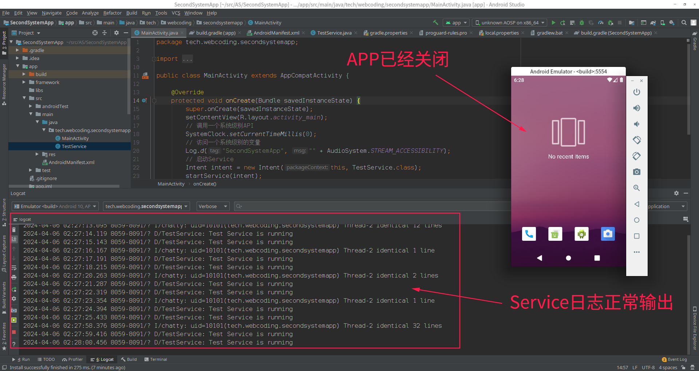

## 一、概述

在实际开发中，大多数情况是使用`AndroidStudio`来开发Android系统应用，本文将介绍如何使用`AndroidStudio`开发Android系统应用。

## 二、开发步骤

### 2.1 编译framework

Android系统APP可以使用很多隐藏的API，所以需要从AOSP源码中把包含隐藏API的jar包编译出来。首先进入源码目录，执行如下命令：

```shell
source build/envsetup.sh
lunch rice14-eng
make framework
```

最终编译产物在`out/target/common/obj/JAVA_LIBRARIES/framework_intermediates/`目录下，包含隐藏API的jar包名称是`classes.jar`。

### 2.2 创建APP项目

做系统开发选择AndroidStudio版本比较重要，我们是基于`Android 10.0.0 r41`的，所以选择的`Android Studio 3.6.3`版本，该版本与`Android 10.0.0 r41`发布时间相接近。应用基本信息如下：


新建好项目之后，在`AndroidManifest.xml`文件的根节点添加以下属性

```xml
android:sharedUserId="android.uid.system"
```

这个代表是系统应用。现在我们在APP项目目录下新建一个`framework`目录，将编译产物`classes.jar`拷贝进去并重命名为`framework.jar`，然后修改项目级别的`build.gradle`文件，在`allprojects`添加如下内容：

```gradle
gradle.projectsEvaluated {
    tasks.withType(JavaCompile) {
        Set<File> fileSet = options.bootstrapClasspath.getFiles()
        List<File> newFileList = new ArrayList<>();
        newFileList.add(new File("./app/framework/framework.jar"))
        newFileList.addAll(fileSet)
        options.bootstrapClasspath = files(newFileList.toArray())
    }
}
```

接下来在app的`build.gradle`中的`dependencies`中添加如下内容：

```gradle
dependencies {
    implementation fileTree(dir: 'libs', include: ['*.jar'])
    implementation 'androidx.appcompat:appcompat:1.3.0'
    implementation 'androidx.constraintlayout:constraintlayout:2.1.4'
    compileOnly files('framework/framework.jar')
    testImplementation 'junit:junit:4.12'
    androidTestImplementation 'androidx.test.ext:junit:1.1.5'
    androidTestImplementation 'androidx.test.espresso:espresso-core:3.5.1'
}
```

接着我们需要制作系统签名，这里使用 keytool-importkeypair (下载地址 <https://github.com/getfatday/keytool-importkeypair>)签名工具，刚脚本放入PATH目录下。接着进入系统源码下的 `build/target/product/security` 路径，执行如下命令：

```shell
keytool-importkeypair -k ./platform.keystore -p android -pk8 platform.pk8 -cert platform.x509.pem -alias platform
```

k 表示要生成的签名文件的名字，这里命名为 platform.keystore -p 表示要生成的 keystore 的密码，这里是 android -pk8 表示要导入的 platform.pk8 文件 -cert 表示要导入的platform.x509.pem -alias 表示给生成的 platform.keystore 取一个别名，这是命名为 platform。

接着，把生成的签名文件 platform.keystore 拷贝到 `Android Studio` 项目的 app 目录下，然后在 `app/build.gradle` 中的`android`节点添加签名的配置信息：

```groovy
signingConfigs {
    sign {
        storeFile file('platform.keystore')
        storePassword 'android'
        keyAlias = 'platform'
        keyPassword 'android'
    }
}
```

同时`anroid`节点下的`buildTypes`节点配置变更如下：

```groovy
buildTypes {
    release {
        minifyEnabled false
        proguardFiles getDefaultProguardFile('proguard-android-optimize.txt'), 'proguard-rules.pro'
        signingConfig signingConfigs.sign
    }
    
    debug {
        minifyEnabled false
        signingConfig signingConfigs.sign
    }
}
```

## 三、修改源代码

### 3.1 调用系统API

我们修改`MainActivity`的`onCreate`方法代码，用于调用系统的隐藏API，如下

```java
public class MainActivity extends AppCompatActivity {

    @Override
    protected void onCreate(Bundle savedInstanceState) {
        super.onCreate(savedInstanceState);
        setContentView(R.layout.activity_main);
        // 调用一个系统级别API
        SystemClock.setCurrentTimeMillis(0);
        // 访问一个系统级别的变量
        Log.d("SecondSystemApp", "" + AudioSystem.STREAM_ACCESSIBILITY);
    }
}
```

### 3.2 Service保活

在java代码目录新增一个`TestService`类，代码如下：

```java
package tech.webcoding.secondsystemapp;

import android.app.Service;
import android.content.Intent;
import android.os.IBinder;
import android.util.Log;

public class TestService extends Service {
    @Override
    public IBinder onBind(Intent intent) {
        return null;
    }

    @Override
    public void onCreate() {
        super.onCreate();
        new Thread() {
            @Override
            public void run() {
                super.run();
                while (true) {
                    Log.d("TestService", "Test Service is running");
                    try {
                        Thread.sleep(1000);
                    } catch (InterruptedException e) {
                        e.printStackTrace();
                    }
                }
            }
        }.start();
    }
}
```

为了验证系统APP能够保活，我们在`AndroidManifest.xml`文件中的`application`节点添加保活属性，并注册Service，代码如下

```xml
<application
    android:allowBackup="true"
    android:icon="@mipmap/ic_launcher"
    android:label="@string/app_name"
    <!-- 添加保活属性 -->
    android:persistent="true"
    android:roundIcon="@mipmap/ic_launcher_round"
    android:supportsRtl="true"
    android:theme="@style/AppTheme">
    <!-- 注册Service -->
    <service
        android:name=".TestService"
        android:enabled="true"
        android:exported="true"/>

    <activity android:name=".MainActivity">
        <intent-filter>
            <action android:name="android.intent.action.MAIN" />

            <category android:name="android.intent.category.LAUNCHER" />
        </intent-filter>
    </activity>
</application>
```

在`MainActivity`启动Service，代码如下：

```java
public class MainActivity extends AppCompatActivity {

    @Override
    protected void onCreate(Bundle savedInstanceState) {
        super.onCreate(savedInstanceState);
        setContentView(R.layout.activity_main);
        // 调用一个系统级别API
        SystemClock.setCurrentTimeMillis(0);
        // 访问一个系统级别的变量
        Log.d("SecondSystemApp", "" + AudioSystem.STREAM_ACCESSIBILITY);
        // 启动Service
        Intent intent = new Intent(this, TestService.class);
        startService(intent);
    }
}
```

## 四、调试验证

`Android Studio 3.6.3`这个版本它不会主动连模拟器，这是一个bug，因此我们需要在IDE的终端上执行`adb connect 127.0.0.1`主动连接模拟器。接下来点击运行程序的按钮，APP打开应用后，手动关掉应用后并观察日志，Service的日志正常输出，说明我们的APP已经成功保活了。如下图


